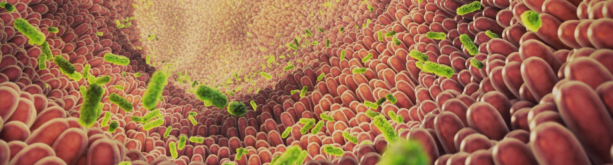

# Bioinformatic Analysis of the *hutH* Gene in the Human Gut Microbiome Across Dysbiosis Contexts

## 📌 Overview

This repository contains the bioinformatic pipeline and analysis code developed for my **Bachelor's Thesis (TFG)** in **Food Science and Technology** (University of Granada, 2025–2026).

The project investigates the **hutH gene** (histidine ammonia-lyase), a microbial gene involved in histidine catabolism and increasingly studied as a functional marker of the gut-brain axis. Using public shotgun metagenomic data, the pipeline quantifies *hutH* abundance across clinical groups (healthy controls, obesity-related dysbiosis, and post-bariatric surgery follow-up) and identifies the bacterial taxa carrying the gene. A second, independent analysis screens the genus *Bifidobacterium* for *hutH*-positive taxa as candidates for functional food development.

All data processing — from automated download of metagenomic profiles to clinical metadata integration and statistical analysis — was built as a reusable Python pipeline querying public repositories (MGnify, ENA, NCBI).

---

## 🎯 Objectives

- Quantify *hutH* gene abundance in the gut microbiota of healthy adults, individuals with obesity-related dysbiosis, and patients following sleeve gastrectomy (1 and 3 months post-op).
- Build an automated pipeline to download and filter shotgun metagenomic profiles from **MGnify** (study **MGYS00005333**).
- Integrate clinical metadata from **ENA** and the **NCBI Run Selector** to classify each sample into its correct clinical group.
- Identify which bacterial taxa carry the *hutH* gene, and test for statistically significant differences in abundance across groups.
- Screen the taxonomic descendants of *Bifidobacterium* (via **NCBI Taxonomy** and the **Entrez/E-utilities API**) to catalogue *hutH*-carrying strains with potential biotechnological interest.

---

## 🧪 Data Sources

| Source | Purpose |
|---|---|
| **MGnify** (study MGYS00005333) | Shotgun metagenomic functional annotation profiles |
| **ENA** + **NCBI Run Selector** | Clinical/experimental metadata for sample classification |
| **NCBI Taxonomy** (`new_taxdump`) | Reconstruction of the *Bifidobacterium* taxonomic lineage (`names.dmp`, `nodes.dmp`) |
| **NCBI Entrez / Protein DB** | Automated screening for *hutH* across *Bifidobacterium* descendant taxa |

Original clinical cohort: Liu et al. (2017), *Nature Medicine* — Han-Chinese young adults recruited at Ruijin Hospital (Shanghai Jiao Tong University).

---

## 📊 Key Results

**Cohort (after filtering):** n = 238 samples
- Control: n = 100
- Dysbiosis: n = 103
- Surgery, month 1: n = 14
- Surgery, month 3: n = 21

*(One additional sample corresponding to month 2 post-surgery was excluded due to lack of biological replicates.)*

- *hutH* abundance drops significantly in the dysbiosis group compared to controls (Kruskal-Wallis + Mann-Whitney, p < 0.05).
- Abundance recovers progressively after surgery, reaching control-comparable levels by month 3.
- Main *hutH*-carrying families: **Bacteroidaceae**, **Porphyromonadaceae**, and **Rikenellaceae**.
- Screening of 903 taxonomic descendants of *Bifidobacterium* identified **45 hutH-positive taxa**: 29 strains, 10 species, 4 subspecies, and 2 with no defined rank — candidates for further functional food / precision nutrition research.

---

## 🛠️ Technologies and Libraries

- **Language:** Python 3.10
- **Environment:** VS Code + Jupyter Notebooks
- **Data manipulation:** `pandas` 2.3.3, `numpy` 2.2.6
- **Bioinformatics / API querying:** `biopython` 1.86, `requests`
- **Visualization:** `matplotlib` 3.10.8, `seaborn` 0.13.2
- **Version control:** Git / GitHub

---

## 📂 Repository structure

```
TFG/
└── data/
│   ├── raw/ # Raw data
│   └── processed/ # Preprocessed data
├── notebooks/ # Jupyter notebooks with analyses
├── assets/ #ReadMe image
├── results/ # Figures, tables, and outputs
├── README.md # Project description
├── .gitignore
└── requirements.txt # Project dependencies
```
---

## ⚙️ Pipeline Overview

1. **Automated download of sample links** — queries the MGnify API for each accession code and stores functional annotation download links, with error handling and resume-on-failure logic to cope with API rate limits.
2. **Streamed download and filtering** — reads each annotation file directly via `pandas` (no local full-file download), filters for *hutH*/histidine-related entries, and appends results with sample/analysis IDs to a consolidated table.
3. **Metadata integration** — merges the *hutH* abundance table with clinical metadata (ENA, NCBI Run Selector, and the original study's supplementary metadata) to assign each sample to its clinical group.
4. **Statistical analysis & visualization** — exploratory bar plots, boxplots with Kruskal-Wallis/Mann-Whitney significance testing, and taxon-level abundance breakdowns by clinical group.
5. **Taxonomic screening (Bifidobacterium)** — parses the NCBI Taxonomy `new_taxdump` snapshot to build a parent→child tree, extracts all descendants of *Bifidobacterium*, and cross-references them against Entrez *hutH* protein records to flag positive taxa.

---

## 🚧 Project Status

**Completed.** Full write-up available as a PDF thesis (in Spanish, with English abstract) upon request.


---

## 🧑🏻‍🎓 Authorship

- **Author:** Elías Zorrilla Galdón  
- **Degree:** Food Science and Technology  
- **University:** University of Granada (UGR) 
- **Academic year:** 2025–2026

---

## 📄 License

This project has been developed for academic purposes. The use of the data and code is restricted to educational and research contexts unless otherwise stated.

---

## 📬 Contact & Connect

- **LinkedIn:** [www.linkedin.com/in/eliaszorrilla](https://www.linkedin.com/in/eliaszorrilla/)
- **Email:** eliaszorrillagaldon@gmail.com
- **Location:** Granada, Spain (Open to local & fully remote opportunities)
